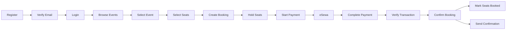
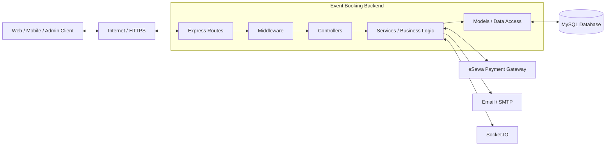
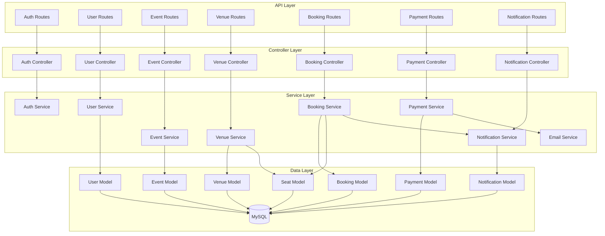
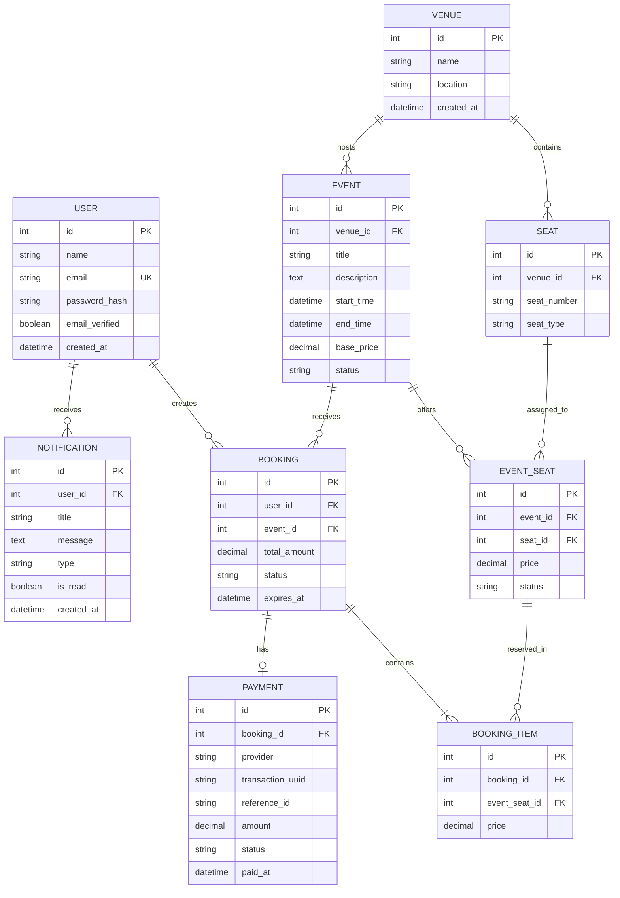
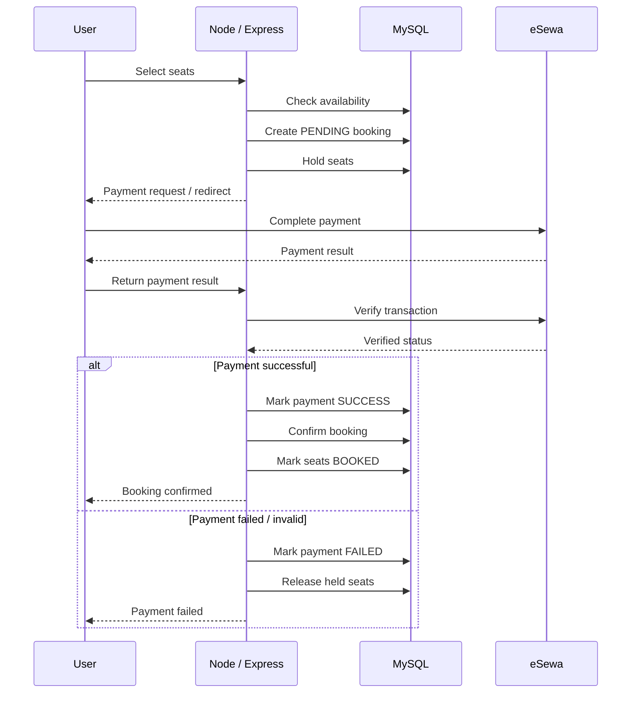
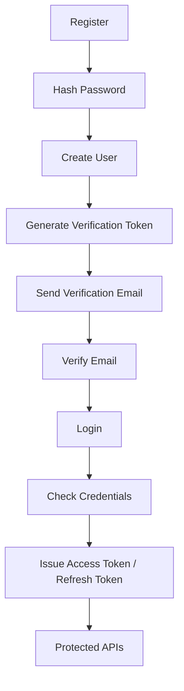
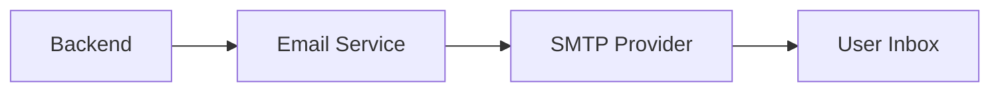
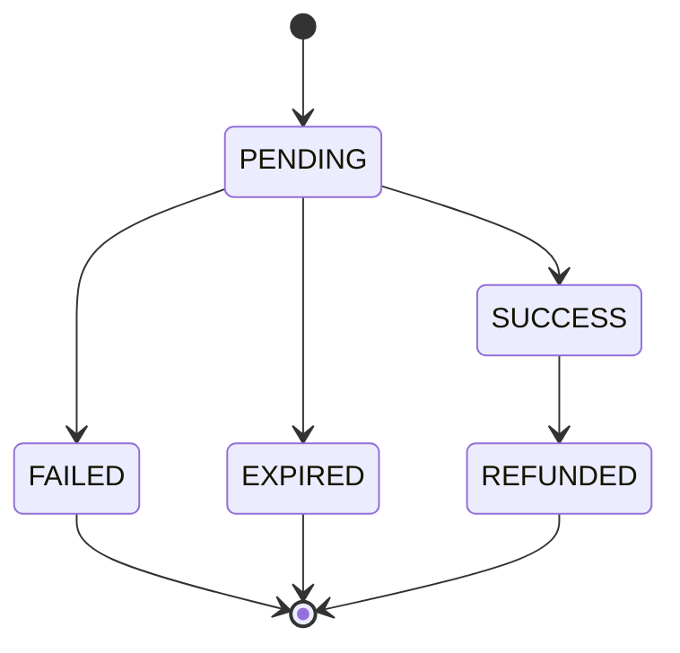

# Event Booking & Payment System

<p align="center">
  <h1 align="center">Event Booking & Payment System</h1>
  <p align="center">
    A backend-focused event booking platform designed to explore authentication,
    seat reservation, database transactions, real payment processing,
    notifications, and real-time updates.
  </p>
</p>

<p align="center">
  
  
  
  
  
  
</p>

---

## 1. Project Overview

The **Event Booking & Payment System** is a planned full-stack event booking platform with a strong focus on backend engineering.

Users will be able to:

- Register and verify their email
- Log in securely
- Browse events
- View venue and seat availability
- Temporarily reserve seats
- Create bookings
- Pay using a real payment gateway
- View booking history
- Receive notifications and email confirmations

Administrators will be able to:

- Create and manage events
- Configure venues and seats
- Monitor bookings
- View payment activity
- Manage event availability

The main purpose is to move beyond simple CRUD and learn how a real backend handles **business rules, concurrency, transactions, external APIs, asynchronous communication, and failure cases**.

---

## 2. Problem We Are Solving

A simple event application can store users, events, and bookings. A real booking platform is more difficult.

For example, two users may try to reserve the same seat at the same time:

```text
                Seat A10
                   |
          +--------+--------+
          |                 |
        User A            User B
          |                 |
          +--------+--------+
                   |
                   v
           Booking Service
                   |
                   v
          Database Transaction
                   |
          +--------+--------+
          |                 |
       First request     Second request
          |                 |
          v                 v
       Seat held       Reject / retry
```

The backend must prevent double booking and keep the database consistent.

Payment creates another problem:

> A browser saying "payment successful" is not enough.

The backend must verify the transaction with the payment provider before confirming the booking.

---

## 3. Core Objectives

1. Build a RESTful API using Node.js and Express.
2. Design a relational MySQL database.
3. Implement authentication and authorization.
4. Implement email verification and password recovery.
5. Implement temporary seat reservation.
6. Prevent double booking using transaction-safe database operations.
7. Integrate a real payment provider, starting with eSewa UAT/testing.
8. Verify payment status on the server before confirming a booking.
9. Send confirmation emails and notifications.
10. Add real-time seat/booking updates with Socket.IO.
11. Use background jobs to release expired reservations.
12. Learn how external services affect backend architecture.

---

# 4. Main System Flow



---

# 5. High-Level System Architecture



### Architectural idea

```text
Client
  |
  v
Routes
  |
  v
Middleware
  |
  v
Controllers
  |
  v
Services
  |
  v
Models
  |
  v
MySQL
```

External providers are accessed by the backend, not trusted directly by the client.

---

# 6. Component Diagram



---

# 7. Database Design

The planned database is centered around events, seats, bookings, and payments.



---

# 8. Seat Reservation Lifecycle

A seat associated with an event will use a controlled state lifecycle:

```text
AVAILABLE
    |
    v
HELD
    |
    +---------- payment success ----------> BOOKED
    |
    +---------- payment failure ----------> AVAILABLE
    |
    +---------- hold expires -------------> AVAILABLE
```

The temporary `HELD` state prevents users from paying for a seat that another user is already attempting to purchase.

---

# 9. Concurrency and Double Booking

Concurrency is one of the major learning objectives.

Example:

```text
User A --------------------                             > Seat A10
User B --------------------/
```

The booking service will use database transactions and appropriate locking/atomic operations to ensure that only one request can successfully claim a seat.

Conceptually:

```sql
START TRANSACTION;

-- verify event seat availability
-- reserve the seat
-- create the pending booking

COMMIT;
```

If a required operation fails:

```sql
ROLLBACK;
```

The exact locking strategy will be selected during implementation based on the final MySQL schema.

---

# 10. Booking Lifecycle

A booking may move through states such as:

```text
PENDING
  |
  +--> CONFIRMED
  |
  +--> PAYMENT_FAILED
  |
  +--> EXPIRED
  |
  +--> CANCELLED
```

The backend will enforce valid transitions rather than allowing the client to set arbitrary states.

---

# 11. Real Payment Integration

The first planned payment provider is **eSewa ePay**.

Development will start with the provider's test/UAT environment rather than real-money transactions.

The current eSewa ePay documentation describes a flow involving:

1. Payment initiation
2. Customer redirection to eSewa
3. Customer payment
4. Redirect/result handling
5. Transaction verification
6. Status checking when needed

The integration also requires request signing using HMAC/SHA-256 according to the provider's documentation.

Official references:

- https://developer.esewa.com.np/pages/Introduction
- https://developer.esewa.com.np/pages/Epay-V2

> Provider URLs, merchant credentials, signed fields, response handling, and verification logic will be taken from the current official documentation during implementation.

---

# 12. Payment Architecture



---

# 13. Critical Payment Rule

The client must never be the authority for payment confirmation.

Incorrect:

```text
Frontend
   |
   | "paymentStatus = success"
   v
Backend
   |
   v
Booking confirmed
```

Correct:

```text
Frontend
   |
   v
Backend
   |
   v
eSewa
   |
   v
Transaction verification
   |
   v
Backend
   |
   v
MySQL
   |
   v
Booking confirmed
```

The server determines whether the payment is valid.

---

# 14. Payment Data

Each booking will have a separate payment record.

Example:

```json
{
  "bookingId": 101,
  "provider": "esewa",
  "transactionUuid": "EVT-101-ABC123",
  "amount": 1500,
  "status": "PENDING"
}
```

After successful verification:

```json
{
  "bookingId": 101,
  "provider": "esewa",
  "transactionUuid": "EVT-101-ABC123",
  "referenceId": "PROVIDER-REF",
  "amount": 1500,
  "status": "SUCCESS"
}
```

Keeping payments separate from bookings makes transaction history and recovery easier to manage.

---

# 15. Authentication

Planned authentication flow:



Authentication:

> Who is the user?

Authorization:

> What is the user allowed to do?

---

# 16. Roles

The initial roles are:

```text
USER
ADMIN
```

### User capabilities

```text
Browse events
View event seats
Reserve seats
Make payments
View own bookings
Cancel eligible bookings
Receive notifications
```

### Admin capabilities

```text
Create events
Update events
Delete events
Manage venues
Manage seats
View all bookings
View payment activity
Manage event availability
```

---

# 17. Email

Email will be used for:

```text
Account verification
Password reset
Booking confirmation
Payment confirmation
Event reminders
```

Architecture:



Nodemailer is planned as the Node.js email library.

---

# 18. Real-Time Updates

Socket.IO will provide real-time communication.

Possible events:

```text
seat-held
seat-released
seat-booked
booking-updated
admin-booking-notification
```

Example:

```text
User A selects A10
       |
       v
Backend holds A10
       |
       v
Socket.IO event
       |
       v
Other connected users
       |
       v
A10 appears unavailable
```

This reduces stale availability information on connected clients.

---

# 19. Background Jobs

Some backend work should happen automatically.

Example:

```text
Every minute
     |
     v
Find expired reservations
     |
     v
Release seats
     |
     v
Expire pending bookings
```

A scheduler such as `node-cron` will be used during the initial implementation.

---

# 20. Planned Backend Structure

```text
event-booking-system/
│
├── migrations/
│
├── src/
│   ├── config/
│   │   └── database.js
│   │
│   ├── controllers/
│   │   ├── auth.controller.js
│   │   ├── user.controller.js
│   │   ├── event.controller.js
│   │   ├── venue.controller.js
│   │   ├── booking.controller.js
│   │   ├── payment.controller.js
│   │   └── notification.controller.js
│   │
│   ├── middleware/
│   │   ├── auth.middleware.js
│   │   ├── role.middleware.js
│   │   ├── error.middleware.js
│   │   └── upload.middleware.js
│   │
│   ├── routes/
│   │   ├── auth.routes.js
│   │   ├── user.routes.js
│   │   ├── event.routes.js
│   │   ├── venue.routes.js
│   │   ├── booking.routes.js
│   │   ├── payment.routes.js
│   │   └── notification.routes.js
│   │
│   ├── services/
│   │   ├── auth.service.js
│   │   ├── user.service.js
│   │   ├── event.service.js
│   │   ├── venue.service.js
│   │   ├── booking.service.js
│   │   ├── payment.service.js
│   │   ├── email.service.js
│   │   └── notification.service.js
│   │
│   ├── models/
│   │   ├── User.js
│   │   ├── Event.js
│   │   ├── Venue.js
│   │   ├── Seat.js
│   │   ├── EventSeat.js
│   │   ├── Booking.js
│   │   ├── BookingItem.js
│   │   ├── Payment.js
│   │   └── Notification.js
│   │
│   ├── jobs/
│   │   ├── reservation.job.js
│   │   └── notification.job.js
│   │
│   ├── validators/
│   │   ├── auth.validator.js
│   │   ├── event.validator.js
│   │   ├── booking.validator.js
│   │   └── payment.validator.js
│   │
│   ├── utils/
│   │   ├── jwt.js
│   │   └── payment.js
│   │
│   ├── app.js
│   └── server.js
│
├── uploads/
├── .env
├── .env.example
├── package.json
└── README.md
```

This is the **planned structure** and can be adjusted as implementation teaches us what is actually necessary.

---

# 21. Planned API

## Authentication

```text
POST   /api/auth/register
POST   /api/auth/login
POST   /api/auth/refresh
GET    /api/auth/verify-email
POST   /api/auth/forgot-password
POST   /api/auth/reset-password
```

## Events

```text
GET    /api/events
POST   /api/events
GET    /api/events/:id
PATCH  /api/events/:id
DELETE /api/events/:id
```

## Venues and Seats

```text
POST   /api/venues
GET    /api/venues
GET    /api/venues/:id
PATCH  /api/venues/:id
DELETE /api/venues/:id

POST   /api/venues/:id/seats
GET    /api/venues/:id/seats
```

## Bookings

```text
POST   /api/bookings
GET    /api/bookings
GET    /api/bookings/:id
POST   /api/bookings/:id/cancel
```

## Payments

```text
POST   /api/payments/esewa
GET    /api/payments/esewa/success
GET    /api/payments/esewa/failure
POST   /api/payments/esewa/verify
GET    /api/payments/:id
```

> These routes are planned. Actual route names may change while implementing the payment provider and booking lifecycle.

## Notifications

```text
GET    /api/notifications
PATCH  /api/notifications/:id/read
DELETE /api/notifications/:id
```

---

# 22. Example Booking Request

A client might send:

```json
{
  "eventId": 21,
  "seatIds": [41, 42]
}
```

The backend should then:

```text
1. Authenticate user
2. Validate request
3. Start database transaction
4. Check event
5. Check selected seats
6. Check / lock availability
7. Calculate price on the server
8. Create pending booking
9. Hold seats
10. Create payment record
11. Commit transaction
12. Start payment flow
```

The final amount is calculated by the server, not trusted from a client-supplied amount.

---

# 23. Payment State Model



The booking lifecycle and payment lifecycle are related but separate.

---

# 24. Security Considerations

The project will include:

- Password hashing with bcrypt
- JWT authentication
- Refresh-token handling
- Role-based authorization
- Request validation
- Rate limiting
- Helmet security headers
- CORS configuration
- Server-side price calculation
- Payment verification
- Transaction-safe seat allocation
- Environment variables for secrets
- Centralized error handling
- File validation for future uploads

Sensitive credentials will not be committed to Git.

Example configuration:

```env
DB_HOST=localhost
DB_PORT=3306
DB_NAME=event_booking
DB_USER=root
DB_PASSWORD=your_password

JWT_SECRET=your_secret
JWT_REFRESH_SECRET=your_refresh_secret

ESEWA_SECRET_KEY=your_provider_secret
ESEWA_PRODUCT_CODE=your_provider_code
```

---

# 25. Technology Stack

| Technology | Purpose |
|---|---|
| Node.js | JavaScript runtime |
| Express.js | REST API framework |
| MySQL | Relational database |
| mysql2 / ORM layer | Database access |
| bcrypt | Password hashing |
| JWT | Authentication |
| Zod | Request validation |
| eSewa ePay | Payment processing |
| Nodemailer | Email sending |
| SMTP | Email transport |
| Socket.IO | Real-time communication |
| node-cron | Background jobs |
| Postman | API testing |
| Git / GitHub | Version control |

---

# 26. Development Roadmap

## Phase 1 — Foundation

```text
Node.js
Express
MySQL
Environment configuration
Database connection
Error handling
Basic middleware
```

## Phase 2 — Authentication

```text
Register
Login
Password hashing
JWT
Refresh tokens
Email verification
Password reset
Roles
```

## Phase 3 — Event Management

```text
Events
Venues
Seats
Admin management
Event availability
```

## Phase 4 — Booking Engine

```text
Seat selection
Temporary holds
Database transactions
Double-booking prevention
Booking lifecycle
```

## Phase 5 — Real Payment

```text
eSewa UAT
Payment initialization
Request signing
Payment result handling
Transaction verification
Status checking
Payment persistence
Booking confirmation
```

## Phase 6 — Communication

```text
Verification emails
Booking confirmation
Payment confirmation
Notifications
```

## Phase 7 — Real-Time

```text
Socket.IO
Live seat updates
Live booking updates
Admin updates
```

## Phase 8 — Reliability

```text
Expired reservation cleanup
Retry handling
Idempotency
Logging
Rate limiting
Unit tests
Integration tests
```

## Phase 9 — Deployment

```text
Production configuration
HTTPS
Secure secrets
Database backups
Monitoring
CI/CD
```

---

# 27. What This Project Is Designed to Teach

This is deliberately more than a CRUD exercise.

### Database

```text
Relationships
Constraints
Indexes
Transactions
Locks
Isolation
Atomic operations
```

### Backend

```text
REST API
Middleware
Controllers
Services
Validation
Authentication
Authorization
Error handling
```

### Payment systems

```text
External APIs
Signatures
Callbacks
Verification
State management
Failure handling
Idempotency
```

### Communication

```text
HTTP
SMTP
WebSockets
External provider APIs
```

### Reliability

```text
Race conditions
Timeouts
Retries
Expired holds
Duplicate requests
Partial failures
```

---

# 28. Learning Progression

The project follows this progression:

```text
Basic REST API
       |
       v
Authentication
       |
       v
Database Design
       |
       v
Business Rules
       |
       v
Transactions
       |
       v
Concurrency
       |
       v
External API Integration
       |
       v
Payment Verification
       |
       v
WebSockets
       |
       v
Background Jobs
       |
       v
Testing & Reliability
       |
       v
Production Deployment
```

The goal is to understand **why each component exists**, not simply add technologies to the project.

---

# 29. End-to-End Success Criteria

The target end-to-end flow is:

```text
User
  |
  v
Register
  |
  v
Verify Email
  |
  v
Login
  |
  v
Browse Event
  |
  v
Select Seats
  |
  v
Create Temporary Reservation
  |
  v
Start Payment
  |
  v
Complete eSewa UAT Payment
  |
  v
Verify Transaction
  |
  v
Confirm Booking
  |
  v
Mark Seats Booked
  |
  v
Send Confirmation
  |
  v
Show Booking in User Account
```

The system must also handle:

```text
Payment failure
Expired reservation
Double-booking attempt
Invalid payment response
Unauthorized access
Invalid input
Missing records
Database failure
Provider timeout
```

---

# 30. What We Are Not Starting With

The first version will not use:

```text
Microservices
Kubernetes
Kafka
Multiple databases
Complex cloud infrastructure
```

The initial architecture is a **modular monolith**:

```text
One Node.js backend
        +
Clear modules
        +
One primary MySQL database
        +
External service integrations
```

This keeps the architecture manageable while still exposing realistic backend problems.

---

# 31. Project Status

**Status: Planning / Initial Development**

The architecture and feature set are defined first. Implementation will proceed incrementally:

```text
Architecture
   ↓
Database
   ↓
Authentication
   ↓
Events / Venues / Seats
   ↓
Booking
   ↓
Transactions
   ↓
eSewa Payment
   ↓
Email / Notifications
   ↓
Socket.IO
   ↓
Testing
   ↓
Deployment
```

---

# 32. References

- [eSewa Developer Portal](https://developer.esewa.com.np/pages/Introduction)
- [eSewa ePay V2 Documentation](https://developer.esewa.com.np/pages/Epay-V2)
- [Node.js Documentation](https://nodejs.org/docs/latest/api/)
- [Express Documentation](https://expressjs.com/)
- [MySQL Documentation](https://dev.mysql.com/doc/)
- [Socket.IO Documentation](https://socket.io/docs/)
- [Nodemailer Documentation](https://nodemailer.com/)

---

# 33. Author

**Aayush Poudel**

GitHub: [@Aayushdai](https://github.com/Aayushdai)

---

> **Project principle:** Build a simple architecture, then make the business rules realistic.
